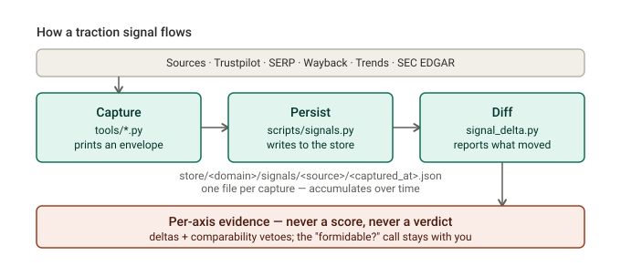

# Traction Signals

*The engine's time-axis layer: **how a company is moving** — growing, winning its category, fading — as cited evidence. Distinct from what a company **is** (that's the [profile / State](SCHEMA.md)).*

**Three things to know:**

- **It's evidence, never a score.** Every output is a per-axis delta bound to one source — "+65 reviews/week," "AI Overview dropped for this query," "Form-D filed Apr 8." There's no blended number and no "formidable?" verdict — that call stays with you.
- **The loop is capture → persist → diff.** Three small tools, one storage path. You'll mostly use the [commands below](#how-to-run-it).
- **It's deliberately small.** A handful of sources (some free, some paid); everything richer — labeled cards, cohort maps, verdicts — is [deferred](#whats-deferred) until something actually needs it.

## How it works



<details>
<summary>Text version</summary>

```
   SOURCES        ──▶   CAPTURE          ──▶   PERSIST              ──▶   DIFF
                        tools/*.py             scripts/signals.py         tools/signal_delta.py
   Trustpilot           prints one             writes it to               reads two captures of
   SERP · Wayback       JSON "envelope"        store/<domain>/signals/    one source, reports what
   Trends · EDGAR       to stdout              <source_type>/             moved + comparability
                        (never writes)         <captured_at>.json         vetoes — never a score
                                               └── captures accumulate here over time ──┘
```

</details>

- **Capture** — a `tools/*.py` script fetches one source and prints a JSON *envelope* to stdout. Tools only print; they never touch the store.
- **Persist** — `scripts/signals.py` writes that envelope to the store path, so repeat captures of the same thing pile up as a timeline.
- **Diff** — `signal_delta.py` reads two captures and reports the deltas. When a clean comparison isn't possible — profile removed, an AI-Overview outage, mismatched normalization — it emits a **veto** (a flagged blank), never a fabricated number.

> *Why no score?* A confident-but-wrong composite destroys trust faster than it adds value; honest per-axis evidence is safe, a made-up number isn't. The full reasoning + the traps are in the [frame](_design/2026-06-14-traction-frame.md).

## How to run it

**Capture one company and store it** — pipe a tool straight into the writer:

```bash
python3 tools/trustpilot.py hims.com | python3 scripts/signals.py persist -
```

Keyword sources (Trends) can't derive the domain — pass it:

```bash
python3 tools/trends.py "Hims::hims" | python3 scripts/signals.py persist - --domain hims.com
```

**See what moved** — two captures of one source (or two *directories* to diff whole runs):

```bash
python3 tools/signal_delta.py <older>.json <newer>.json
```

**The weekly loop** — a panel of captures in one go (`panel.jsonl` = one `{"tool": …, "args": […]}` per line):

```bash
python3 scripts/signals.py run panel.jsonl --dry-run   # preview, spends nothing
python3 scripts/signals.py run panel.jsonl             # capture + store the lot
```

**Consolidate scattered captures** into the store: `python3 scripts/signals.py import <dir>`

> **Cost:** Wayback, Trends, SEC EDGAR are **free**. Trustpilot, SERP, Exa, Ads cost credits — run those deliberately (`--dry-run` first).

## What we capture today

| Source | What it tells you | Cost |
|---|---|---|
| **Trustpilot** | review count + velocity + integrity flags | paid |
| **SERP** | organic rank **and** AI-Overview presence (diffed apart) | paid |
| **Wayback** | page tenure / presence / content change | free |
| **Trends** | branded-search trajectory (within a brand, not cross-brand) | free |
| **SEC EDGAR** | funding: ticker→State, Form-D & filings→dated event | free |

The first four are **diffed over time** by the comparator; SEC EDGAR emits **dated events** (existence + date, never the dollar amount). *Also live but less central: Exa (similar-company discovery), Ads Transparency (paid-ad presence).*

## What's deferred

Built only when a consumer pulls it — never on a schedule:

- **Labeled "cards"** — evidence labels + good/bad-for-whom polarity. *Today the store holds raw envelopes only.*
- **Cohort maps** — category crowdedness / dominance / hotness. Its own design frame.
- **A "formidable?" verdict** — viewer-specific, kept *outside* the shared store by design.
- **Smaller items** — a SQLite query lens, whole-domain Wayback diffing, a one-command verb. On the [backlog](tools/BACKLOG.md).

---

###### Read next

[Traction frame](_design/2026-06-14-traction-frame.md) — *why* it exists, the traps, scope · [Traction approach](_design/2026-06-15-traction-approach.md) — the v1 plan + what's deferred · [`signal_delta.md`](tools/signal_delta.md) · [`sec_edgar.md`](tools/sec_edgar.md) · [`tools/README.md`](tools/README.md) · [`scripts/signals.py`](scripts/signals.py)
